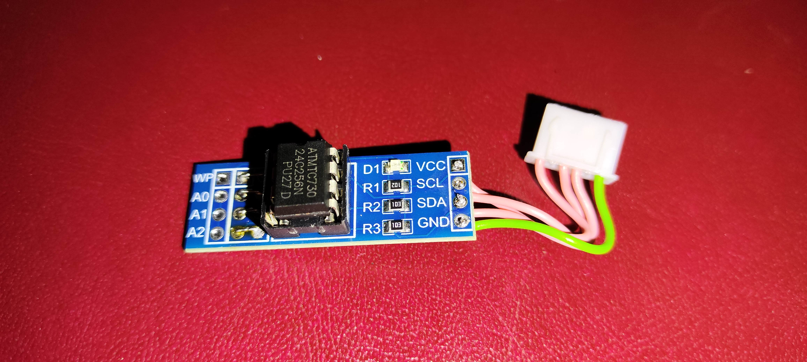
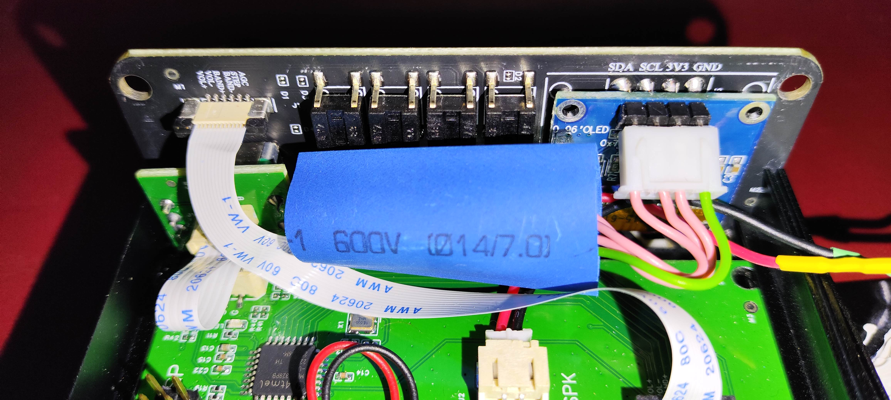
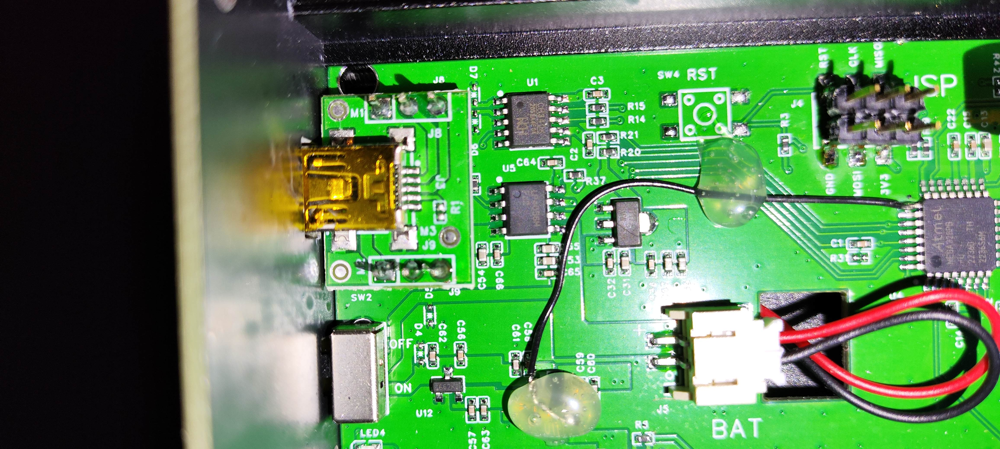

# Read me for ATS_20PLUS
## _Why this repo?_

The developer of ATS_EX has written that there was no memoryspace available for additional functions. That's why I didn't think it made sense to report an issue.

This repo is a mixture of the example SI473X_ALL_IN_ONE_OLED_RDS_CHINESE_V8r by PU2CLR and the repo ATS_EX.
The display style is more beautiful from ATS_EX albeight it personal.
The shortcomings of ATS_EX is the missing stereo indicator and rigide RDS implemention of showing only the first 17 characters. The RDS programinfo was not shown on the display of my device. Only the senderinformation was shown. I suppose it is a bug, but the RDS info from PU2CLR implementation is prefered by me.

My decision was therefore to store the SSB patch in a separate EEPROM, which was already implemented in principle in the PU2CLR_SI4735 library. 

A minor code modification was necessary for this. The only shortcoming was that no error message is displayed if the patch is not loaded correctly. This is in the PU2CLR_SI4735 repository, which is available here. Even if the patch loads correctly, the status is briefly displayed on the display.

The voltage divider with SMD components has been added to display the battery charge percentage. This can be seen in the photo below.

## Features

- More memory available by moving the SSB patch to an external EEPROM.
- Display indicator for the FM stereo signal.
- Full display of the transmitted RDS information. 

